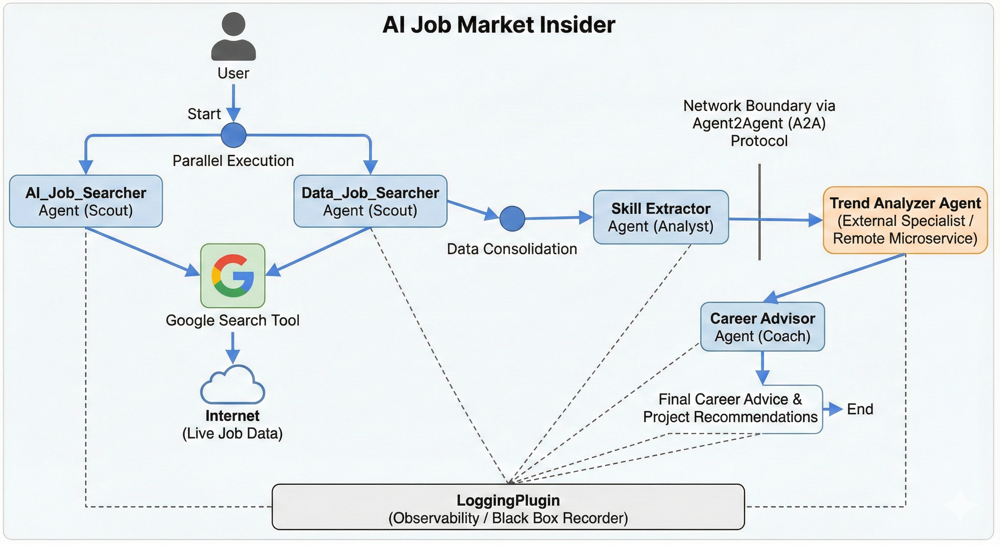

# AI Job Market Insider and Career Advisor🕵️‍♂️🤖📊

**A Multi-Agent System (MAS) built with the Google Agent Development Kit (ADK) that automates job market research using parallel execution and remote microservices.**

  

---

## 📖 Project Overview

Finding the "hot" skills in the AI job market usually involves hours of reading conflicting articles and messy job descriptions. **AI Job Market Insider** solves this by deploying a team of specialized AI agents to scour the web, clean the data, analyze trends, and provide actionable career advice—all in seconds.

Unlike a standard script, this project utilizes **Distributed Agent Architecture**. It treats agents like specialized employees, some working locally in parallel and others working as remote consultants via network protocols.

## 🏗️ Architecture

The system mimics a real-world analytics firm with the following workflow:

1.  **Parallel Search:** Two Scout agents search for different domains simultaneously.
2.  **Consolidation:** Data is aggregated and passed to an Analyst.
3.  **Remote Consultation:** The Analyst queries a separate Trend Analyzer microservice via A2A.
4.  **Advisory:** A Coach agent synthesizes the findings into a career roadmap.




---

## 🤖 The Agent Team

We modeled this system after a human research team using the **Google Gen AI SDK**:

### 1. The Scouts (Parallel Team) 🕵️
* **Agents:** `AI_Job_Searcher` & `Data_Job_Searcher`
* **Role:** These agents utilize the **Google Search Tool** to find live job descriptions.
* **Engineering Highlight:** These run in **Parallel**. Instead of blocking execution, both agents fire simultaneously, reducing data gathering time by ~50%.

### 2. The Analyst (Skill Extractor) 🧹
* **Role:** Receives raw, unstructured text from the Scouts. It performs **Data Cleaning** and **Entity Extraction** to create a structured list of skills (e.g., removing duplicates like "PyTorch" vs "Pytorch").

### 3. The External Specialist (Trend Analyzer) 📡
* **Role:** Classifies skills into "Rising" vs. "Foundational."
* **Engineering Highlight (Microservice):** This agent does **not** live in the main application. It runs as a standalone service. The main app connects to it using the **Agent2Agent (A2A) Protocol**. This demonstrates secure, cross-service communication between AI systems.

### 4. The Coach (Career Advisor) 🎓
* **Role:** Takes the structured trend report and generates a specific project idea (e.g., "Build a RAG Chatbot") to help the user demonstrate the required skills.

---

## 🛠️ Key Technical Concepts

This project demonstrates advanced utilization of the Google ADK:

* **Sequential vs. Parallel Execution:** Orchestrating agents to run concurrently for efficiency (Scouts) vs. linearly for dependency management (Analyst -> Coach).
* **Agent2Agent (A2A) Protocol:** Implementing remote procedure calls between agents to simulate distributed systems.
* **Tool Use:** Integrating external APIs (Google Search) allows agents to ground their responses in real-time data, reducing hallucinations.
* **Observability:** Integrated `LoggingPlugin` acts as a "Black Box Recorder," tracing the thought process (Chain of Thought) of every agent for debugging and optimization.

---

## 🚀 How to Run

### Prerequisites
* Python 3.10+
* Google Cloud Project with Gemini API enabled
* Google Search Tool credentials

### Installation

1.  **Clone the repository:**
    ```bash
    git clone [https://github.com/your-username/adk-multi-agent-job-insider.git](https://github.com/your-username/adk-multi-agent-job-insider.git)
    cd adk-multi-agent-job-insider
    ```

2.  **Install dependencies:**
    ```bash
    pip install -r requirements.txt
    ```

3.  **Set up Environment Variables:**
    Create a `.env` file in the root directory:
    ```env
    GOOGLE_API_KEY=your_gemini_api_key
    GOOGLE_CSE_ID=your_search_engine_id
    GOOGLE_API_KEY_SEARCH=your_search_api_key
    ```

4.  **Run the System:**
    
    This system requires two terminals because of the microservice architecture.

    **Terminal 1 (Start the Remote Specialist):**
    ```bash
    python specialist_agent_server.py
    ```

    **Terminal 2 (Run the Main Pipeline):**
    ```bash
    python main_pipeline.py
    ```

---

## 📊 Example Output

```text
[System] Starting Parallel Scouts...
[Scout 1] Found 5 hot jobs for 'AI Engineer'
[Scout 2] Found 5 hot jobs for 'Data Scientist'
[Analyst] Extracted Skills: {Python, RAG, LangChain, Snowflake, SQL}
[A2A Connection] Connecting to Remote Trend Analyzer... Success.
[Coach] FINAL ADVICE:
Based on the rise of 'RAG' and 'Snowflake' in recent listings, you should build:
"A Corporate Knowledge Base Chatbot"
1. Use Snowflake to store document vectors.
2. Use LangChain for the retrieval mechanism.
3. This covers 80% of the trending skills found.
